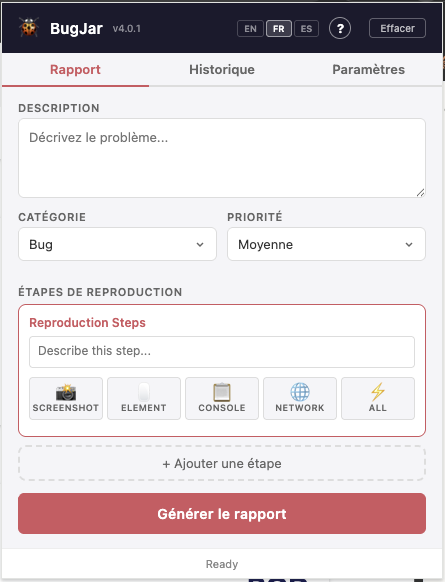
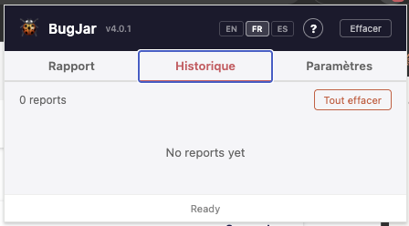
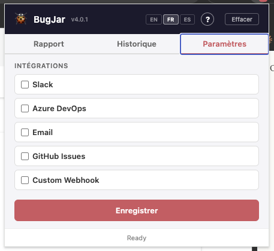

<p align="center">
  
</p>

<h1 align="center">BugJar</h1>

<p align="center">
  <strong>Capture bugs in a jar.</strong><br>
  Step-based bug reproduction with screenshots, console, network, annotations.<br>
  Sends reports to Slack, Azure DevOps, GitHub, Email, or any webhook.
</p>

<p align="center">
  
  
  
  
  
</p>

---

## Screenshots

<p align="center">
  
  &nbsp;&nbsp;
  
  &nbsp;&nbsp;
  
</p>

<p align="center">
  <em>Report</em> &nbsp;&nbsp;&nbsp;&nbsp;&nbsp;&nbsp;&nbsp;&nbsp;&nbsp;&nbsp;&nbsp;&nbsp;&nbsp;&nbsp;&nbsp;&nbsp;&nbsp;&nbsp;&nbsp;&nbsp;&nbsp;&nbsp;&nbsp;&nbsp;&nbsp;&nbsp;
  <em>History</em> &nbsp;&nbsp;&nbsp;&nbsp;&nbsp;&nbsp;&nbsp;&nbsp;&nbsp;&nbsp;&nbsp;&nbsp;&nbsp;&nbsp;&nbsp;&nbsp;&nbsp;&nbsp;&nbsp;&nbsp;&nbsp;&nbsp;&nbsp;&nbsp;&nbsp;&nbsp;
  <em>Settings</em>
</p>

---

## What it does

A Chrome extension that lets **anyone** — developers, QA, clients, integrators — report bugs with full context using a **step-by-step reproduction flow**. Reports are sent to your tools (Azure DevOps, GitHub, Slack) and saved locally for download.

### How it works

1. **Open BugJar** on the page with the bug — monitoring starts automatically
2. **Describe** the issue + choose category and priority
3. **Add reproduction steps** — each step can capture its own screenshots, DOM elements, console logs, and network requests
4. **Generate Report** — sends to configured integrations + saves to History
5. **Download** the `.md` report from History whenever you need it

### Step-based reproduction

Each bug report is organized into **steps**. One step for a simple bug, multiple steps for complex flows:

```
Step 1: "Go to /settings"
  └── 📸 screenshot of the page

Step 2: "Click Save"
  └── 🖱️ button.btn-save (selected element)
  └── 📋 3 console errors (with stack traces)
  └── 🌐 POST /api/settings → 500 (with response body)
  └── 📸 screenshot showing the error
```

## Features

### Capture

| Feature | Description |
|---------|-------------|
| **Auto-monitoring** | Console + network captured automatically when popup opens |
| **Screenshot** | Capture visible tab + annotate (pen, arrows, rectangles, text, colors) |
| **Console** | Last 100 messages with timestamps + stack traces for errors |
| **Network** | XHR/fetch requests with status, duration + response body for 4xx/5xx |
| **DOM Inspector** | Click any element → tag, classes, CSS selector, XPath, computed styles |
| **Multi-elements** | Select multiple elements per step (accumulates, not replaces) |
| **Multi-screenshots** | Multiple screenshots per step |
| **Framework detection** | Detects Angular, React, Vue, jQuery with version |
| **SPA navigation** | Tracks pushState/replaceState route changes |
| **Storage keys** | Captures localStorage/sessionStorage key names + sizes |
| **Environment** | Resolution, DPR, OS, browser, language, timezone, touch support |

### Integrations

Reports are sent **automatically** to all enabled integrations when you generate a report. Sent in parallel for speed.

| Integration | What it does | Screenshots |
|-------------|-------------|-------------|
| **🔷 Azure DevOps** | Creates Work Item with HTML body (images embedded) | ✅ Inline `` |
| **🐙 GitHub Issues** | Creates issue with labels (bug/enhancement/priority) | Text only |
| **💬 Slack** | Sends formatted message to channel via webhook | Text only |
| **✉️ Email** | Opens mail client (short) or downloads .md + summary (long) | Via attachment |
| **🔗 Custom Webhook** | POST/PUT JSON to any URL (Jira, n8n, Zapier, Teams...) | In JSON payload |

### Per-site profiles

Each website can have its **own integration config**:

```
Profile: *.toto.com  → GitHub repo-toto
Profile: *.titi.fr   → Azure DevOps project-A
Profile: *.tata.fr   → Azure DevOps project-B
Profile: Default     → Slack + Email (fallback for unmatched sites)
```

BugJar auto-detects which profile to use based on the current page URL.

### Category auto-mapping

The report category automatically maps to the correct type on each platform:

| BugJar Category | Azure DevOps | GitHub Labels | Slack |
|-----------------|-------------|---------------|-------|
| Bug | Bug | `bug` | :beetle: Bug |
| Feature Request | User Story | `enhancement` | :bulb: Feature |
| Question | Task | `question` | :question: Question |
| Other | *(settings default)* | — | :memo: Other |

Azure DevOps type can be set to **Auto** (recommended) or forced to a specific type.

### History

- All reports saved locally with full content
- **Download** button (⬇️) to get the `.md` file whenever you need it
- Integration results with **clickable links** to work items / issues
- Platform icons (🔷 🐙 💬 ✉️ 🔗) show where each report was sent
- Delete individual reports or clear all

### More

| Feature | Description |
|---------|-------------|
| **i18n** | English, French, Spanish with language selector |
| **Dark mode** | Follows system preference automatically |
| **Onboarding** | Built-in help guide (?) for new users |
| **Auto-update** | Checks GitHub releases every 24h, shows badge |
| **Keyboard shortcuts** | `Ctrl+Shift+B` open, `Ctrl+Shift+J` capture all |
| **Per-integration guides** | Step-by-step setup instructions for each platform |

## Install

1. Download the [latest release](https://github.com/jgounand/BugJar/releases/latest)
2. Unzip `BugJar-vX.X.X.zip`
3. Open `chrome://extensions/` in Chrome
4. Enable **Developer mode** (top right toggle)
5. Click **Load unpacked** → select the unzipped folder
6. The BugJar icon appears in the toolbar

## Generated Report

The `.md` file is structured for AI consumption (Claude, ChatGPT):

```markdown
# Bug Report / Feedback
**URL:** https://app.example.com/settings
**Category:** Bug  |  **Priority:** High

## Environment
- Browser: Chrome 120.0.0.0
- Framework: Angular 21.0.0
- Resolution: 1920x1080

## Description
The save button doesn't respond after editing...

## Reproduction Steps

### Step 1: Go to /settings


### Step 2: Click Save
**Selected elements:**
- `button.btn-save` — #form > .actions > button (120x40)

**Console (3 errors):**
10:30:01 [ERROR] TypeError: Cannot read property 'save' of undefined
  at SettingsComponent.onSave (settings.component.ts:45)

**Failed requests:**
| POST | 500 | /api/settings | 234ms |
> Response: {"error":"Column 'NAME' cannot be null"}


```

## Security

- **Zero secrets in source code** — all credentials stored per-user in `chrome.storage.local`
- **No data sent anywhere** except to the integrations you explicitly configure
- **No analytics, no telemetry, no tracking**
- External API calls routed through background service worker (no CORS issues, no extra permissions)
- Open-source — inspect every line of code

## Tech

- Vanilla JavaScript — no framework, no build step, no bundler
- Chrome Extension Manifest V3
- Canvas API for annotations
- Zero external dependencies
- 96 unit tests (`node tests/test.js`)

## Keyboard Shortcuts

| Shortcut | Action |
|----------|--------|
| `Ctrl+Shift+B` (Mac: `Cmd+Shift+B`) | Open BugJar popup |
| `Ctrl+Shift+J` (Mac: `Cmd+Shift+J`) | Quick capture all |

## License

Current versions (v1.x–v4.x): **MIT License** — free for personal and commercial use.

Future versions may be released under a different license. See [LICENSE](LICENSE) for details.

Copyright (c) 2026 Joris Gounand — All rights reserved for future versions.
